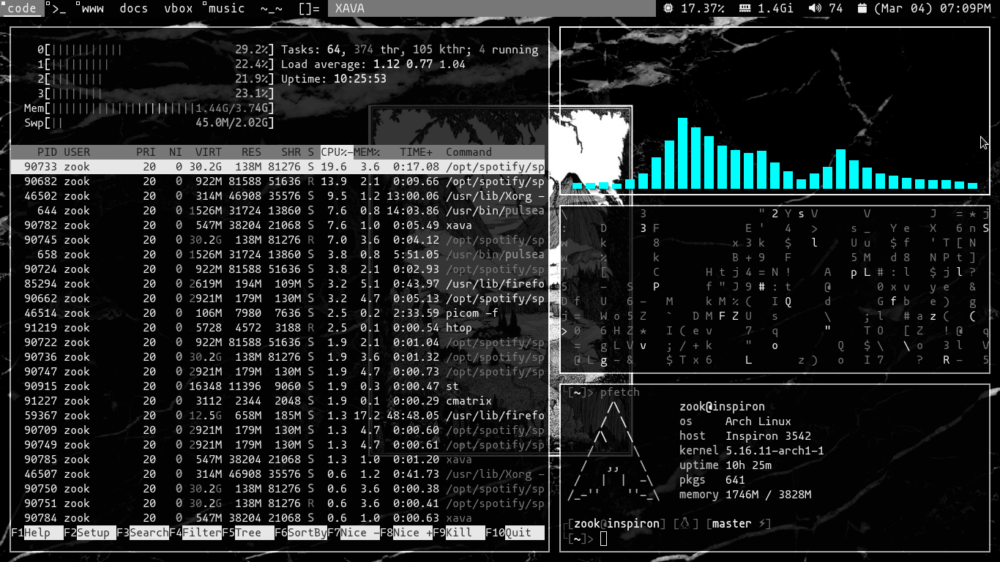
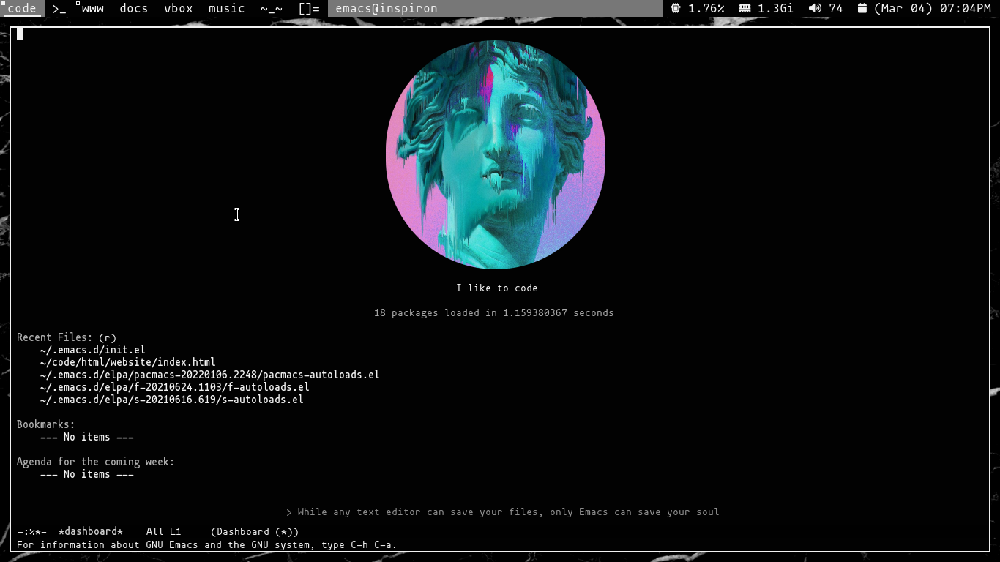

# Summary

* All my config files in one repo

* You can contribute if you want to !

# Programs

* Window Manager: Dwm

* Terminal Emulator: St

* App Launcher: dmenu

* GUI: Xorg

* Text Editor: Emacs

# Screenshots

Dwm 

Emacs

